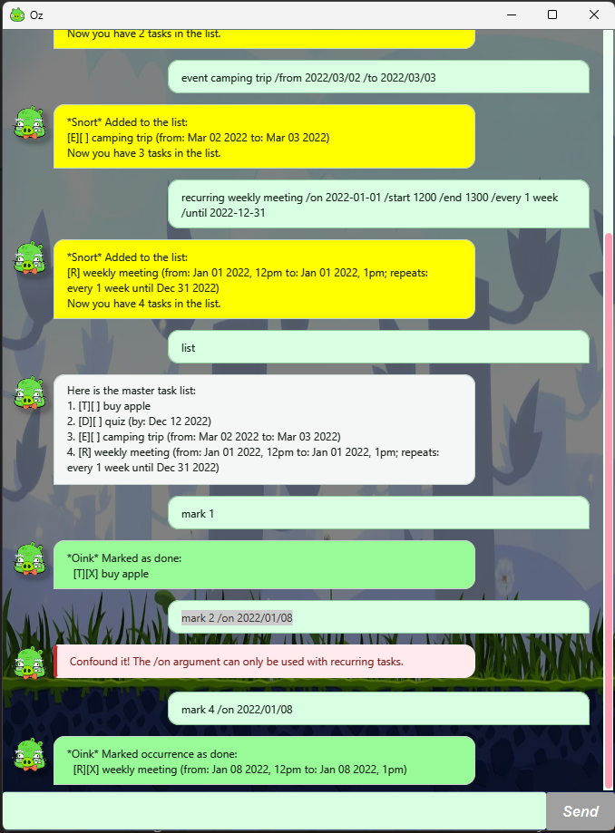

# Oz User Guide

**Oz** is a task-management chatbot for keeping track of todos, deadlines,
events, and weekly recurring events using short text commands. Oz saves every
change automatically, so your tasks are ready when you return.

## Quick start

1. Install Java 25 or later.
2. Put `oz.jar` in the folder where you want Oz to store its data.
3. Open a terminal in that folder and run `java -jar oz.jar`.
4. Type a command in the box at the bottom of the window and press **Enter** or
   click **Send**.

Try `todo read chapter 1`, followed by `list`.

## Command format

- Words in `UPPER_CASE` are values you supply. For example, replace
  `DESCRIPTION` with `read chapter 1`.
- Items in square brackets are optional.
- Command words and parameter flags are case-sensitive and should be typed in
  lowercase.
- Parameters must appear in the order shown.
- Descriptions cannot contain the `|` character.

## Features

### Add a todo: `todo`

Adds a task without a date.

Format: `todo DESCRIPTION`

Example: `todo read chapter 1`

### Add a deadline: `deadline`

Adds a task that must be completed by a date or date and time.

Format: `deadline DESCRIPTION /by DATE_TIME`

Example: `deadline submit report /by 2026-10-02 1800`

### Add an event: `event`

Adds an event with a start and end. The start cannot be after the end.

Format: `event DESCRIPTION /from START /to END`

Example:
`event project meeting /from 2026-10-02 1400 /to 2026-10-02 1600`

### Add a recurring event: `recurring`

Adds a same-day event that repeats every specified number of weeks. Omit
`/until` to repeat indefinitely; when supplied, the end date is inclusive.

Format: `recurring DESCRIPTION /on DATE /start TIME /end TIME /every NUMBER weeks [/until DATE]`

Examples:

- `recurring tutorial /on 2026-10-02 /start 1000 /end 1200 /every 1 week`
- `recurring team sync /on 2026-10-02 /start 2pm /end 3pm /every 2 weeks /until 2026-12-31`

The end time cannot be before the start time, and `NUMBER` must be a positive
whole number.

### View tasks: `list` and `on`

Use `list` to display every task and its task number.

Use `on DATE` to display deadlines, events, and recurring occurrences on a
particular date. An event spanning several days appears on every date it spans;
todos do not appear because they have no date.

Examples:

- `list`
- `on 2026-10-02`

### Find tasks: `find`

Finds tasks whose descriptions contain the given keyword or phrase. Matching is
case-insensitive.

Format: `find KEYWORD`

Example: `find report`

### Mark or unmark tasks

Marks a task as done or not done. `NUMBER` is the task number shown by `list`.

Formats:

- `mark NUMBER`
- `unmark NUMBER`

Examples: `mark 1` and `unmark 1`

For a recurring event, include the date of the occurrence instead. The date
must be one on which that series occurs.

- `mark NUMBER /on DATE`
- `unmark NUMBER /on DATE`

Example: `mark 2 /on 2026-10-16`

> **Tip:** Run `list` before using `mark`, `unmark`, or `delete`. Numbers shown
> by `find` and `on` number only those displayed results, not the master task
> list.

### Delete a task: `delete`

Deletes a task permanently. Deleting a recurring event removes the entire
series.

Format: `delete NUMBER`

Example: `delete 1`

### Exit Oz: `bye`

Closes Oz. Your changes have already been saved automatically.

Format: `bye`

## Dates and times

For the simplest experience, use dates in `YYYY-MM-DD` format and times in
24-hour `HHmm` or `H:mm` format:

- Date: `2026-10-02`
- Date and time: `2026-10-02 1800` or `2026-10-02 18:00`
- Time: `1400`, `14:00`, or `2pm`

Oz also accepts dates as `D/M/YYYY`, `YYYY/M/D`, or `D-M-YYYY`, such as
`2/10/2026`. Dates must exist on the calendar.

## Command summary

| Action | Command |
| --- | --- |
| Add a todo | `todo DESCRIPTION` |
| Add a deadline | `deadline DESCRIPTION /by DATE_TIME` |
| Add an event | `event DESCRIPTION /from START /to END` |
| Add a recurring event | `recurring DESCRIPTION /on DATE /start TIME /end TIME /every NUMBER weeks [/until DATE]` |
| List all tasks | `list` |
| List tasks on a date | `on DATE` |
| Find tasks | `find KEYWORD` |
| Mark a task | `mark NUMBER` |
| Mark a recurring occurrence | `mark NUMBER /on DATE` |
| Unmark a task | `unmark NUMBER` |
| Unmark a recurring occurrence | `unmark NUMBER /on DATE` |
| Delete a task or recurring series | `delete NUMBER` |
| Exit | `bye` |

## Saving data

Oz automatically saves changes to `data/oz.txt`, relative to the folder from
which it is run. Keep a copy of this file when moving Oz to another computer.
